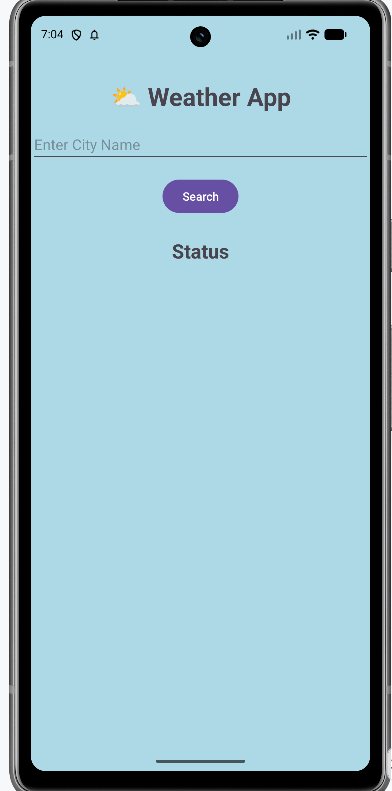
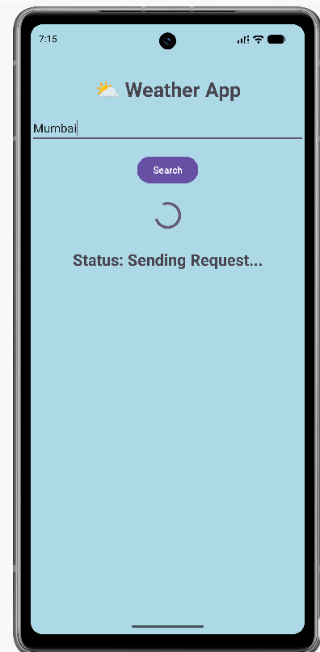
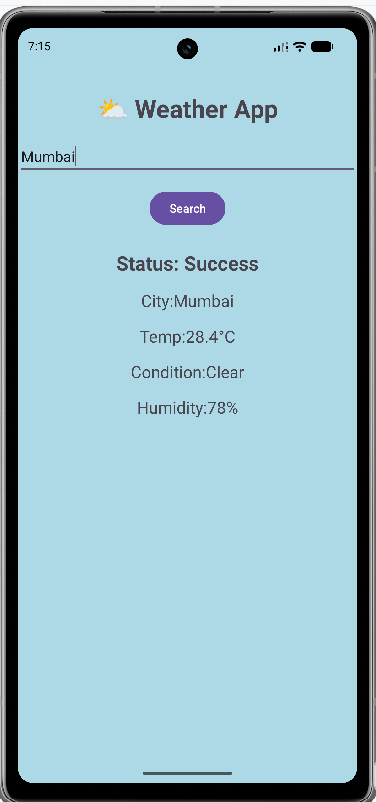
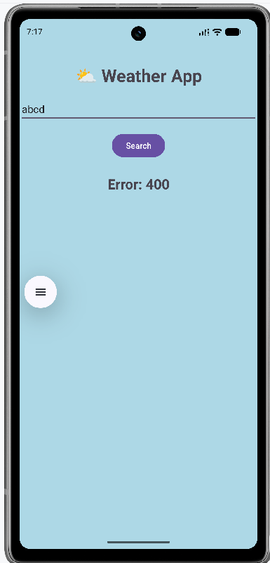

# 🌤️ WeatherApp

WeatherApp is an Android application that provides weather information for searched locations using weather and geocoding APIs.

The project was developed as part of Android development learning and focuses on API integration, MVVM architecture, Repository Pattern, and network data handling.

## ✨ Features

- Search weather by city name
- Retrieve location coordinates using geocoding
- Fetch weather information using a REST API
- Display temperature and weather details
- Handle API/network errors
- MVVM-based application architecture
- Repository Pattern for data handling
- Retrofit for API communication

## 🛠️ Technologies Used

- **Language:** Java
- **Platform:** Android
- **Architecture:** MVVM
- **Networking:** Retrofit
- **APIs:** Geocoding API, Weather API
- **IDE:** Android Studio
- **Version Control:** Git & GitHub

## 🏗️ Architecture

The application follows the **MVVM (Model-View-ViewModel)** architecture along with the **Repository Pattern**.

**Application Flow:**

**UI**  
↓  
**ViewModel**  
↓  
**Repository**  
↓  
**Retrofit**  
↓  
**Weather / Geocoding API**

### Architecture Components

- **UI:** Displays weather information and handles user interaction.
- **ViewModel:** Manages UI-related data and application state.
- **Repository:** Acts as the data layer between the ViewModel and APIs.
- **Retrofit:** Handles HTTP requests and API communication.
- **Weather API:** Provides weather information.
- **Geocoding API:** Converts the searched city into geographical coordinates.

## 📱 Project Purpose

The purpose of this project was to practice building a real-world Android application with external API integration and a structured application architecture.

## 👨‍💻 Author

**Manthan Panchal**

## 📸 Screenshots

Screenshots of the application will be added here.

| Home | Loading |
|---|---|
|  |  |

| Result | Error |
|---|---|
|  |  |

## ⚙️ Setup

1. Clone the repository.

2. Open the project in Android Studio.

3. Create or open the `local.properties` file in the project root.

4. Add your WeatherAPI key:

   `WEATHER_API_KEY=YOUR_WEATHERAPI_KEY`

5. Replace `YOUR_WEATHERAPI_KEY` with your own WeatherAPI key.

6. Sync the project with Gradle.

7. Build and run the application.

> **Note:** Never commit your API key to GitHub. The `local.properties` file is ignored by Git.